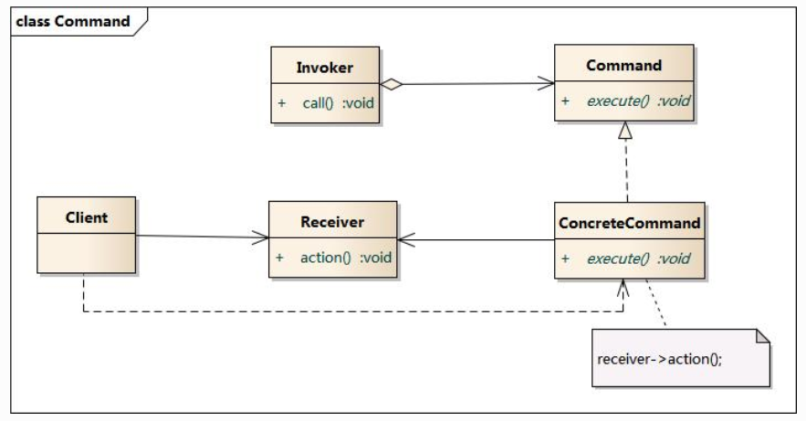
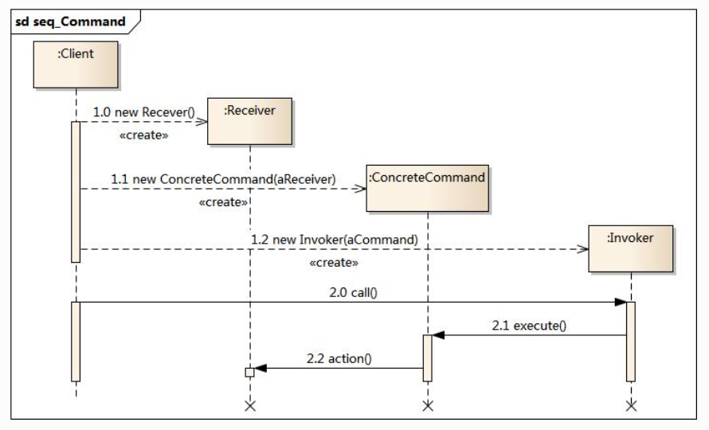

### 命令模式

#### 动机

> 在软件设计中，我们经常需要向某些对象发送请求，但是并不知道请求的接收者是谁，也不知道被请求的操作是哪个，我们只需在程序运行时指定具体的请求接收者即可，此时，可以使用命令模式来进行设计，使得请求发送者与请求接收者消除彼此之间的耦合，让对象之间的调用关系更加灵活。
>
> 命令模式可以对发送者和接收者完全解耦，发送者与接收者之间没有直接引用关系，发送请求的对象只需要知道如何发送请求，而不必知道如何完成请求。这就是命令模式的模式动机。

#### 定义

> 命令模式(Command Pattern)：将一个请求封装为一个对象，从而使我们可用不同的请求对客户进行参数化；对请求排队或者记录请求日志，以及支持可撤销的操作。命令模式是一种对象行为型模式，其别名为动作(Action)模式或事务(Transaction)模式。

#### 结构

命令模式包含如下角色：

- Command: 抽象命令类
- ConcreteCommand: 具体命令类
- Invoker: 调用者
- Receiver: 接收者
- Client:客户类

#### 时序图

