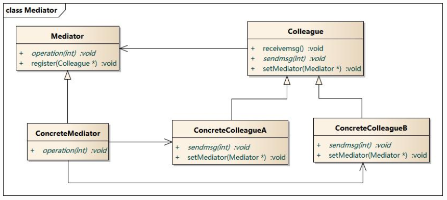
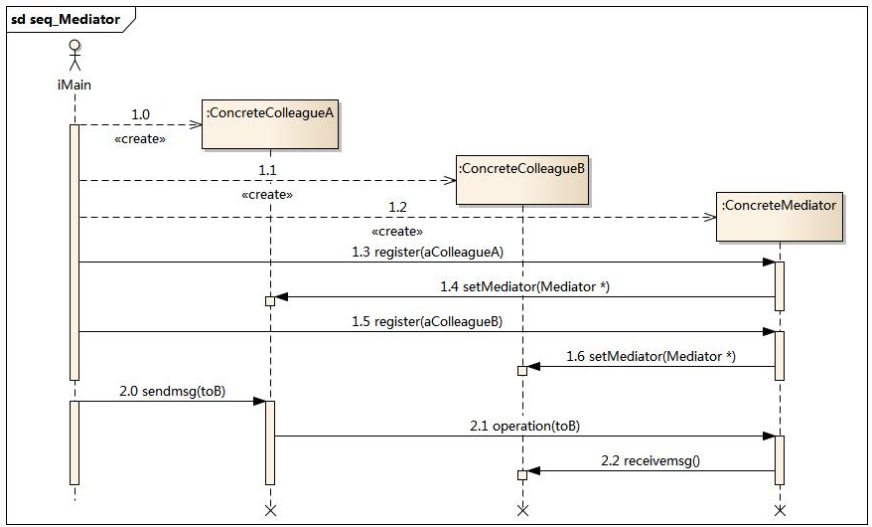

### 中介者模式

#### 动机

- 在用户与用户直接聊天的设计方案中，用户对象之间存在很强的关联性，将导致系统出现如下问题：
- 系统结构复杂：对象之间存在大量的相互关联和调用，若有一个对象发生变化，则需要跟踪和该对象关联的其他所有对象，并进行适当处理。
- 对象可重用性差：由于一个对象和其他对象具有很强的关联，若没有其他对象的支持，一个对象很难被另一个系统或模块重用，这些对象表现出来更像一个不可分割的整体，职责较为混乱。
- 系统扩展性低：增加一个新的对象需要在原有相关对象上增加引用，增加新的引用关系也需要调整原有对象，系统耦合度很高，对象操作很不灵活，扩展性差。
- 在面向对象的软件设计与开发过程中，根据“单一职责原则”，我们应该尽量将对象细化，使其只负责或呈现单一的职责。
- 对于一个模块，可能由很多对象构成，而且这些对象之间可能存在相互的引用，为了减少对象两两之间复杂的引用关系，使之成为一个松耦合的系统，我们需要使用中介者模式，这就是中介者模式的模式动机。

#### 定义

> 中介者模式(Mediator Pattern)定义：用一个中介对象来封装一系列的对象交互，中介者使各对象不需要显式地相互引用，从而使其耦合松散，而且可以独立地改变它们之间的交互。中介者模式又称为调停者模式，它是一种对象行为型模式。

#### 结构

中介者模式包含如下角色：

- Mediator: 抽象中介者
- ConcreteMediator: 具体中介者
- Colleague: 抽象同事类
- ConcreteColleague: 具体同事类

#### 时序图

