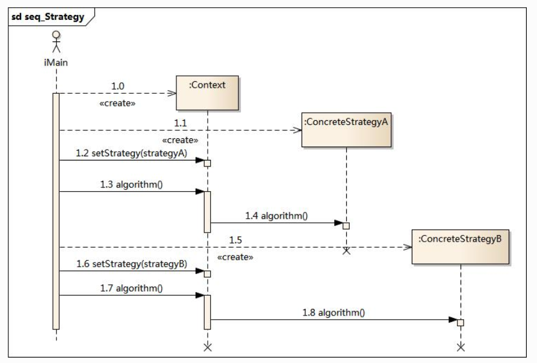

### 策略模式

#### 动机

- 完成一项任务，往往可以有多种不同的方式，每一种方式称为一个策略，我们可以根据环境或者条件的不同选择不同的策略来完成该项任务。
- 在软件开发中也常常遇到类似的情况，实现某一个功能有多个途径，此时可以使用一种设计模式来使得系统可以灵活地选择解决途径，也能够方便地增加新的解决途径。
- 在软件系统中，有许多算法可以实现某一功能，如查找、排序等，一种常用的方法是硬编码(Hard Coding)在一个类中，如需要提供多种查找算法，可以将这些算法写到一个类中，在该类中提供多个方法，每一个方法对应一个具体的查找算法；当然也可以将这些查找算法封装在一个统一的方法中，通过if…else…等条件判断语句来进行选择。这两种实现方法我们都可以称之为硬编码，如果需要增加一种新的查找算法，需要修改封装算法类的源代码；更换查找算法，也需要修改客户端调用代码。在这个算法类中封装了大量查找算法，该类代码将较复杂，维护较为困难。
- 除了提供专门的查找算法类之外，还可以在客户端程序中直接包含算法代码，这种做法更不可取，将导致客户端程序庞大而且难以维护，如果存在大量可供选择的算法时问题将变得更加严重。
- 为了解决这些问题，可以定义一些独立的类来封装不同的算法，每一个类封装一个具体的算法，在这里，每一个封装算法的类我们都可以称之为策略(Strategy)，为了保证这些策略的一致性，一般会用一个抽象的策略类来做算法的定义，而具体每种算法则对应于一个具体策略类。

#### 定义

> 策略模式(Strategy Pattern)：定义一系列算法，将每一个算法封装起来，并让它们可以相互替换。策略模式让算法独立于使用它的客户而变化，也称为政策模式(Policy)。
>
> 策略模式是一种对象行为型模式。

#### 结构

策略模式包含如下角色：

- Context: 环境类
- Strategy: 抽象策略类
- ConcreteStrategy: 具体策略类

#### 时序图

