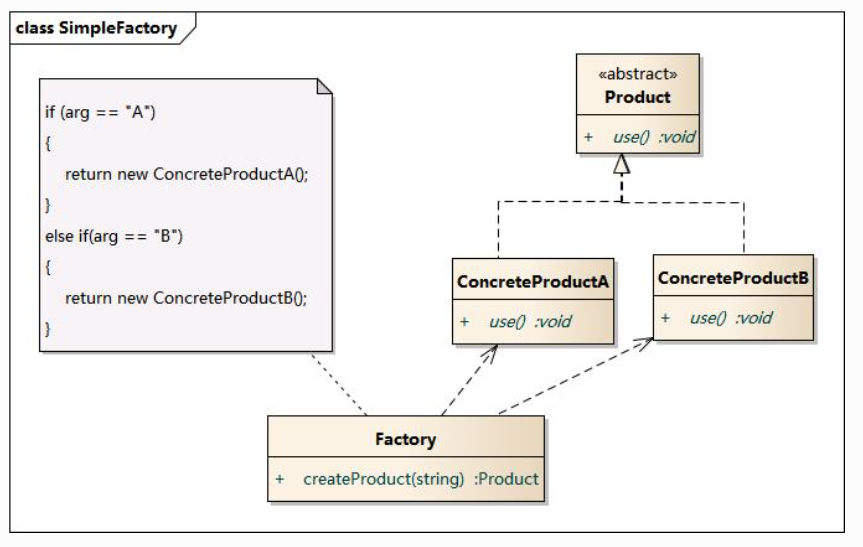
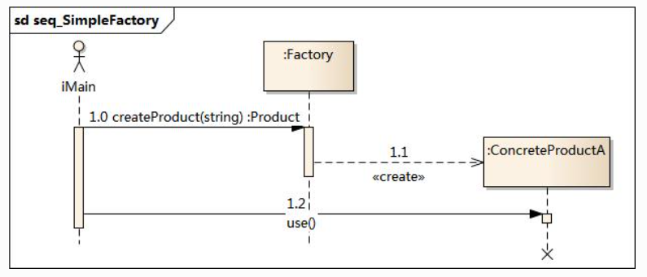

### 简单工厂模式

#### 动机

> 考虑一个简单的软件应用场景，一个软件系统可以提供多个外观不同的按钮(如圆形按钮、矩形按钮、菱形按钮等)
> ,这些按钮都源自同一个基类，不过在继承基类后不同的子类修改了部分属性从而使得它们可以呈现不同的外观，如果我们希望在使用这些按钮时，不需要知道这些具体按钮类的名字，只需要知道表示该按钮类的一个参数，并提供一个调用方便的方法，把该参数传入方法即可返回一个相应的按钮对象，此时，就可以使用简单工厂模式。

#### 定义

> 简单工厂模式(Simple Factory Pattern)：又称为静态工厂方法(Static Factory Method)
> 模式，它属于类创建型模式。在简单工厂模式中，可以根据参数的不同返回不同类的实例。简单工厂模式专门定义一个类来负责创建其他类的实例，被创建的实例通常都具有共同的父类。

#### 结构

简单工厂模式包含如下角色：

- Factory：工厂角色
  工厂角色负责实现创建所有实例的内部逻辑
- Product：抽象产品角色
  抽象产品角色是所创建的所有对象的父类，负责描述所有实例所共有的公共接口
- ConcreteProduct：具体产品角色
  具体产品角色是创建目标，所有创建的对象都充当这个角色的某个具体类的实例。

#### 时序图

