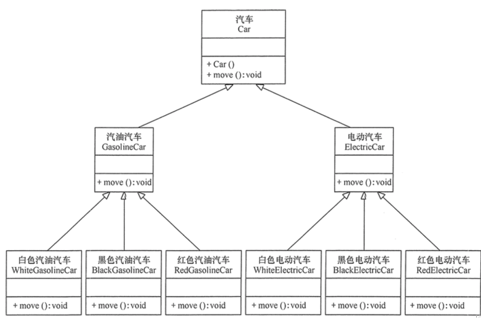

### 前言

面向对象设计原则是评价每个设计模式应用效果的重要依据；几乎每个设计模式都符合一个或多个面向对象设计原则（个别除外），这些原则都是从无数项目中提取出来的经验原则，它们为消除软件设计和实现中的"
臭味（Bad Smell）"而诞生，力图为当前系统提供最好的设计方案；简单来说设计原则是描述"面向对象开发"需要注意的代码原则。

用武侠小说的话来说，如果把设计模式比作剑法招式，那设计模式就是内功心法，而心法就像"道"，关键在于"悟"；怎么"悟"
呢，还是要考虑程序员的功力；设计原则只是一把量尺、准则，但要怎么用，还要结合具体的业务、场景，不能一概而论；必要的时候，甚至需要违背某些设计原则来进行编程。

### 1、单一职责原则

#### 1.1、What

单一职责原则，SRP(Single Responsibility Priniciple)

定义：不要存在多于一个导致类变更的原因

补充：一个类、接口、方法，都只负责一项职责

#### 1.2、Why

- 降低复杂度
- 提高可读性
- 提高可维护性
- 降低变更引起的风险

如果一个对象承担了太多职责，会出现以下问题：

- 承担职责越多，被复用的可能越小
- 承担职责越多，就相当于将这些职责耦合在一起，当其中一个职责变化，可能会影响其他职责的运作
- 当客户端需要该对象的某一个职责时，不得不将其他不需要的职责全都包含进来，从而造成冗余代码或代码的浪费，也违背了【接口隔离原则】

#### 1.3、How

单一职责原则就是实现高内聚、低耦合的指导方针，它是最简单但又最难运用的原则，需要设计人员发现类的不同职责并将其分离，这需要设计人员具有较强的分析设计能力和相关实践经验

**职责**
这一词，其实是没有衡量标准的，具体粒度大小，其实在不同业务场景、不同开发人员看来，都是不一样的；在实际开发中，建议的做法，一开始可以先不用过分考虑；而当类太大、方法太长的时候，再使用该原则进行重构；这个原则可以用于类、接口、方法、模块的

一个方法，只做一件事，这句话的其中一个理解是方法体的代码实现只做方法名的名字定义的事情；譬如：setX()方法，就只对 x
这个属性进行赋值，这种方法，一般是系统生成的；但如果对这个方法进行重定义了，比如增加了持久化的操作，把 x
的值保存到数据库中，就违背了【单一职责原则】

解决办法如下：

- 可以分割为两个方法，一个只修改 x 属性的值，另一个进行持久化操作，从而保证每个方法的单一职责；
- 修改方法名，比如改为 updateX() ，从而扩大方法的职责；这里就体现了职责的粒度其实是可变的，在不同业务情况下，可以灵活处理

### 2、开闭原则

#### 2.1、What

开闭原则，OCP(Open Close Principle)

定义：一个软件实体，如类、模块和函数应当对扩展开放，对修改关闭；即软件实体应尽量在不修改原有代码的情况下进行扩展

补充：用抽象构建框架，用实现扩展细节

核心思想：拥抱变化；面向抽象编程；解耦

#### 2.2、Why

任何软件都需要面临一个很重要的问题，即她们的需求会随时间的推移而发生变化；当软件系统需要面对新的需求时，应该尽量保证系统的设计框架是稳定的；如果一个软件设计符合开闭原则，那么可以非常方便地对系统进行扩展，而且在扩展时无需修改现有代码，使得软件系统在拥有适应性和灵活性的同时具备较好的稳定性和延续性；随着软件规模
越来越大，软件寿命越来越长，软件维护成本越来越高，设计满足开闭原则的软件系统也变得越来越重要

开闭原则是衡量每个设计模式优缺点的重要评价依据，是面向对象的可复用设计的第一块基石，是最重要的面向对象设计原则；使用开闭原则有利于提高软件系统的可复用性、可维护性，实现稳定、灵活的系统架构

#### 2.3、How

**用抽象构建框架，用实现扩展细节**

为了满足开闭原则，需要对系统进行抽象化设计，抽象化是开闭原则的关键；在Java等编程语言为了满足开闭原则，需要对系统定义一个相对稳定的抽象层，而将不同的实现行为移至具体的实现层中完成；在很多面向对象变成语言中都提供了接口、抽象类等机制，可以通过它们定义系统的抽象层，在通过具体类来进行扩展；如果需要修改系统的行为，无需对抽象层进行任何改动，只需要增加新的具体类来实现新的业务功能即可，实现在不修改已有代码的基础上扩展系统的功能，达到开闭原则的要求

**如何通过开闭原则实现向下兼容，平滑升级**

- 对于枚举：不建议在已有枚举的数值中插入新的值，而是在已有枚举的数据后追加新的值
- 对于函数：不要修改原来函数的参数和返回值，但可以增加重载方法(语法上不能单独重载返回值)

- 对于类-原有类：不要修改类原有的属性和方法，但可以在原来的类中增加新的属性和方法

- 对于类-派生：不要修改原有类的属性和方法，但可以通过派生子类的方式来增加新的属性和方法

- 对于模块：不要修改对外暴露的头文件定义的属性和方法，但可以增加

- 对于后端接口：不要修改原来的参数，但可以增加参数

### 3、里氏代换原则

#### 3.1、What

里氏代换原则，LSP(Liskov Substitution Principle)

定义：所有引用基类(父类)的地方必须能透明地使用其子类的对象

> Barbara Liskov 是美国计算机科学家，2008年图灵奖得主，2004年约翰·冯诺依曼奖得主，美国工程院院士，美国艺术与科学院院士，美国计算机协会会士，麻省理工学院电子电气与计算机科学系教授，她是美国第一位计算机科学女博士。

#### 3.2、Why

- 约束继承泛滥，阐述了什么时候该用继承，什么时候不应该用继承，反应了基类与子类之间的关系，是开闭原则的一种体现
- 加强程序的健壮性，降低系统的出错率；类的扩展不会给原类造成影响，降低了代码出错的范围和系统出错的概率
- 提高代码的重用性，代码变更时可以做到非常好的兼容性，提高程序的可维护性、可扩展性，降低需求变更时引入的风险

#### 3.3、How

里氏代换原则是实现开闭原则的重要方式之一

- 用基类定义对象

  由于使用基类对象的地方都可以使用子类对象，因此在程序中尽量使用基类类型来对对象进行定义，而在运行时再确定其子类类型，用子类对象来替换父类对象；

- 将基类设计为抽象类或者接口

  在运用里氏代换原则时，应该将父类设计为抽象类或者接口，让子类继承父类或实现父接口，并实现在父类中声明的方法；程序运行时，子类实例替换父类实例，可以很方便地扩展系统的功能，无须修改原有子类的代码，增加新的功能可以通过增加一个新的子类来实现

子类可以扩展父类的功能，但不能改变父类原有的功能，需要遵守如下要求

- 子类中可以增加自己特有的方法
- 子类可以实现父类的抽象方法，但不能覆盖父类的非抽象方法—— 编译器不会报错（以java为例）
- 当子类的方法重载父类的方法时，方法的输入参数要比父类方法的输入参数更宽松或相等—— 编译器不会报错（以java为例）
- 当子类的方法实现父类的方法时(重写/重载或实现抽象方法)方法的返回值要比父类的返回值更严格或相等—— 编译器会做检查并报错（以java为例）
- 禁止在实际编码中，使用强制转换把父类强转换为子类
- 谨慎对父类的非抽象方法的重定义（慎用，但不禁止，如果有正当理由，可以这么做）
  一个方式，父类既然已经有了实现，子类再去重定义改方法，本质上，就是改变了父类原有的功能

### 4、依赖倒置原则

#### 4.1、What

依赖倒置原则，DIP(Dependence Inversion Principle)

定义：

- 高层模块不应该依赖底层模块，二则都应该依赖其抽象
- 抽象不应该依赖细节，细节应该依赖抽象
- 针对接口编程，不要针对实现编程

#### 4.2、Why

如果说开闭原则是面向对象设计的目标的话，那么依赖倒置原则就是面向对象设计的主要实现机制之一，他是系统抽象化的具体实现

> 在引入抽象层后，系统将具有很好的灵活性；在程序中尽量使用抽象层进行编程，而将具体类写在配置文件中；这样一来，如果系统行为发生变化，只需要对抽象层进行扩展，并修改配置文件，而无需修改原有的源代码，就能扩展系统的功能，满足开闭原则的要求

依赖倒置原则可以减少类间的耦合性、提高系统稳定性，提高代码可读性和可维护性，可降低修改程序所造成的风险

#### 4.3、How

- 在程序代码中传递参数时或在关联关系中，尽量引用层次高的抽象层类

  即是用接口和抽象类进行变量类型声明、参数类型声明、方法返回类型声明，以及数据类型的转换等，而不要用具体类来做这些事情

- 一个具体类应当只实现接口或抽象类中声明过的方法，而不要给出多余的方法，否则将无法调用到在子类中增加的新方法

从UML图来理解，依赖倒置原则，就是把下午中的情况1逐步改造为情况3

### 5、接口隔离原则

#### 5.1、What

接口隔离原则，ISP(Interface Segregation Principle)

定义：用多个专门的接口，而不使用单一的总接口，客户端不应该依赖它不需要的接口

这里的"接口"有两种不同的含义

- 一个类型所具有的方法特征的集合，仅仅是一种逻辑上的抽象

  此时，接口的划分将直接带来类型的划分；可以把接口理解成角色，一个接口只能代表一个角色，每个角色都有它特定的一个接口，此时，这个原则可以叫作“角色隔离原则”

- 某种语言具体的“接口”定义

  此时，该原则表达的意识是指接口仅仅提供客户端需要的行为，客户端不需要的行为则隐藏起来，应当为客户端提供尽可能小的单独的接口，而不要提供大的总接口；在面向对象编程语言中，实现一个接口就需要实现该接口中定义的所有方法，因此大的总接口使用起来不一定很方便；为了使接口的职责单一，需要将大接口中的方法根据其职责不同分别放在不同的小接口中，以确保每个接口使用起来较为方便，并各承担某单一角色；接口应该尽量细化，同时接口中的方法应该尽量少，每个接口中只包含一个客户端(
  如子模块或业务逻辑类)所需的方法即可，这种机制也成为“定制服务”，即为不同的客户端提供宽窄不同的接口

#### 5.2、Why

可以反过来问，如果不遵守接口隔离原则，会怎么样；如果接口承担了太多职责，会导致以下后果

- 导致该接口的实现类很庞大，在不同的实现类中都不得不是先接口中定义的所有方法，灵活性较差，如果出现大量的空方法，将导致系统中产生大量的无用代码，影响代码质量
- 由于客户端针对大接口编程，将在一定程度上破坏程序的封装性，客户端看到了不应该看到的方法，没有为客户端定制接口

因此需要将该接口按照接口隔离原则和单一职责进行重构，将其中的一些方法封装在不同的小接口中，确保每个接口使用起来都较为方便，并各承担某单一角色，每个接口中只包含一个客户端(
如模块或类)所需的方法即可

接口隔离原则符合常说的高内聚低耦合的设计思想，使得类具有很好的可读性、可扩展性和可维护性

#### 5.3、How

- 建立单一接口，不要建立庞大臃肿的接口；当一个接口太大时，需要将它分割成一些更细小的接口，使用该接口的客户端仅需知道与之相关的方法即可
- 注意控制接口的粒度，接口不能太小，如果太小导致系统中接口泛滥，不利于维护；接口也不能太大，太大的接口将违背接口隔离原则，灵活性较差，使用起来很不方便
- 可以把【单一职责原则】比作指导思想，而【接口隔离原则】就是这个事项的一种具体实践

### 6、合成复用原则

#### 6.1、What

合成复用原则，CRP(Composite Reuse Principle)又称为组合/聚合复用原则

定义：尽量使用对象组合，而不是继承来达到复用的目的

【合成复用原则】就是在一个新的对象里通过关联关系(包括组合关系和聚合关系)
来使用一些已有的对象，使之成为新对象的一部分；新对象通过委派调用已有对象的方法达到复用功能的目的；简言之：复用时要尽量使用组合/聚合关系(
关联关系)，少用继承

【合成复用原则】同【里氏代换原则】相辅相成的，两者都是【开闭原则】的具体实现规范

#### 6.2、Why

通常类的服用分为"继承复用"和"合成复用"两种；"继承复用"虽然有简单和易实现的优点，但它也存在一下缺点：

- 继承复用破坏了类的封装性；因为继承会将父类的实现细节暴露给子类，父类对子类是透明的，所以这种复用又称为"白箱"复用
- 子类与父类的耦合度高；父类实现的任何改变都会导致子类的实现发生变化，这不利于类的扩展与维护
- 它限制了服用的灵活性；从弗雷继承而来的实现是静态的，在编译时已经定义，所以在运行时不可能发生变化
- 继承方式过度使用，会导致类的数量快速增长，会增加系统构建和维护的难度以及系统的复杂度

采用合成复用时，可以将已有对象纳入新对象中，使之成为对象的一部分，新对象可以调用已有对象的功能，它有一下优点：

- 它维持了类的封装性；因为成员对象的内部细节是新对象看不见的，所以这种复用又称为"黑箱"复用
- 新旧类之间的耦合度低；这种服用所需的依赖较少，新对象存取成员对象的唯一方法是通过成员对象的接口
- 服用的灵活性高；这种复用可以在运行时动态进行，新对象可以动态地引用与成员对象类型相同的对象
- 功能的扩展不会导致类数量的增加

使用【合成复用原则】可以使系统更加灵活，降低类与类之间的耦合度一个类的变化对其它类造成的影响相对较少

#### 6.2、How

合成复用原则，就是把上图改造为下图的过程：

### 7、迪米特原则

#### 7.1、What

迪米特原则，LOD，Law of Demeter

也叫【最少知道原则】The Least Knowledge Principle

定义：一个对象应该对其它对象保持最少的了解，使得系统功能模块相对独立，这样当一个模块修改时，影响的模块就会越少，扩展起来更加容易

#### 7.2、Why

可以降低系统的耦合度，一个对象的改变不会给太多其他对象带来影响

#### 7.3、How

**只和朋友交流，不和陌生人说话**

- 当前对象本身以及当前对象所创建的对象
- 当前对象的成员对象，如果当前对象的成员对象是一个集合，那么集合中的元素也都是朋友
- 以参数形式传入到当前对象方法中的对象

任何一个对象，如果满足上面条件之一，就是当前对象的"朋友"，否则就是"陌生人"

**第三者通信法**

如果两个对象之间不必彼此直接通信，那么这两个对象就不应当发生任何直接的相互作用；如果其中一个对象需要调用另一个对象的方法，可以通过第三者转发这个调用；简言之，就是通过引入一个合理的第三者降低现有对象之间的耦合度

参考书籍

[1] 设计模式的艺术 作者：刘伟