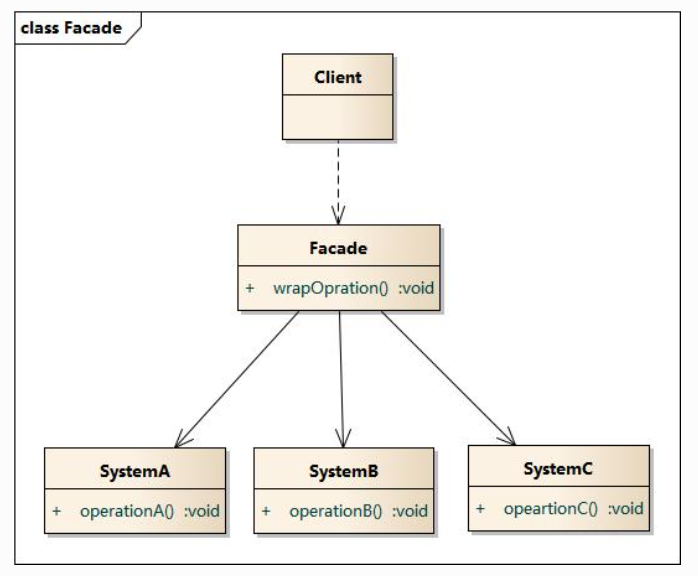

### 外观模式

#### 动机

> 提供一个统一的接口，用来访问子系统中的一群接口，外观定义了一个高层的接口，让子系统更容易使用。 其实就是为了方便客户的使用，把一群操作，封装成一个方法。

#### 定义

> 外观模式(Facade Pattern)：外部与一个子系统的通信必须通过一个统一的外观对象进行，为子系统中的一组接口提供一个一致的界面，外观模式定义了一个高层接口，这个接口使得这一子系统更加容易使用。外观模式又称为门面模式，它是一种对象结构型模式。

#### 结构

外观模式包含如下角色：

- Facade: 外观角色
- SubSystem:子系统角色

#### 时序图

