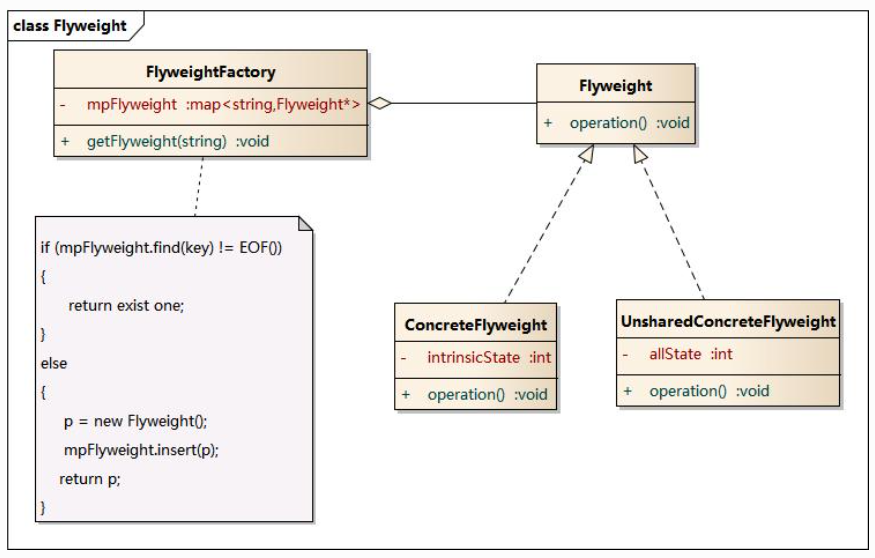
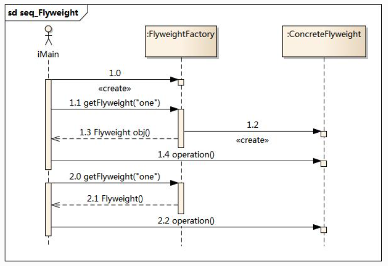

### 享元模式

#### 动机

> 面向对象技术可以很好地解决一些灵活性或可扩展性问题，但在很多情况下需要在系统中增加类和对象的个数。当对象数量太多时，将导致运行代价过高，带来性能下降等问题。

- 享元模式正是为解决这一类问题而诞生的。享元模式通过共享技术实现相同或相似对象的重用。
- 在享元模式中可以共享的相同内容称为内部状态(IntrinsicState)，而那些需要外部环境来设置的不能共享的内容称为外部状态(
  Extrinsic State)，由于区分了内部状态和外部状态，因此可以通过设置不同的外部状态使得相同的对象可以具有一些不同的特征，而相同的内部状态是可以共享的。
- 在享元模式中通常会出现工厂模式，需要创建一个享元工厂来负责维护一个享元池(Flyweight Pool)用于存储具有相同内部状态的享元对象。
- 在享元模式中共享的是享元对象的内部状态，外部状态需要通过环境来设置。在实际使用中，能够共享的内部状态是有限的，因此享元对象一般都设计为较小的对象，它所包含的内部状态较少，这种对象也称为细粒度对象。享元模式的目的就是使用共享技术来实现大量细粒度对象的复用。

#### 定义

> 享元模式(Flyweight Pattern)：运用共享技术有效地支持大量细粒度对象的复用。系统只使用少量的对象，而这些对象都很相似，状态变化很小，可以实现对象的多次复用。由于享元模式要求能够共享的对象必须是细粒度对象，因此它又称为轻量级模式，它是一种对象结构型模式。
 
#### 结构

享元模式包含如下角色：

- Flyweight: 抽象享元类
- ConcreteFlyweight: 具体享元类
- UnsharedConcreteFlyweight: 非共享具体享元类
- FlyweightFactory: 享元工厂类

#### 时序图

