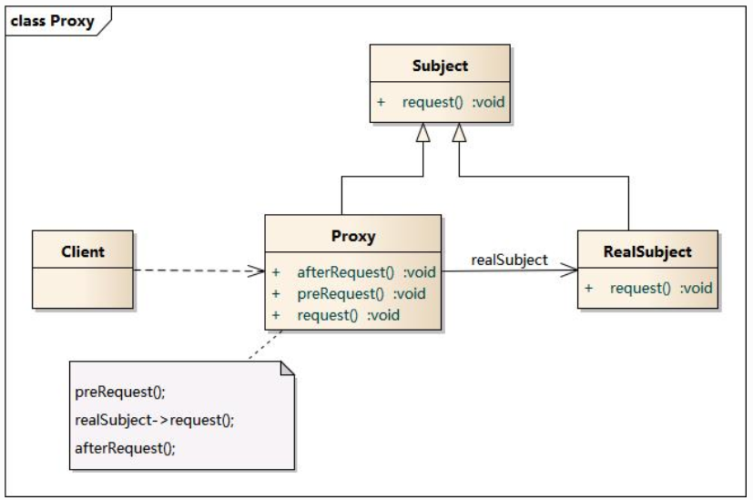
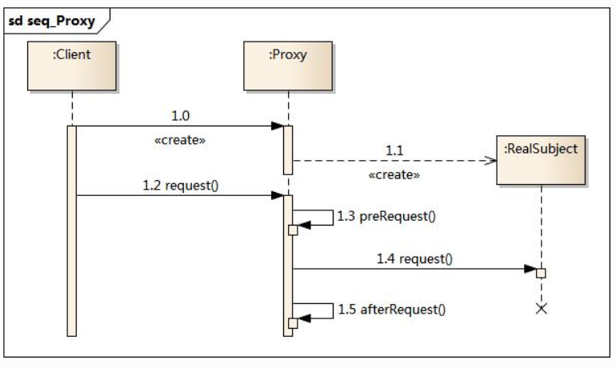

### 代理模式

#### 动机

> 在某些情况下，一个客户不想或者不能直接引用一个对 象，此时可以通过一个称之为“代理”的第三者来实现 间接引用。代理对象可以在客户端和目标对象之间起到
> 中介的作用，并且可以通过代理对象去掉客户不能看到 的内容和服务或者添加客户需要的额外服务。
>
> 通过引入一个新的对象（如小图片和远程代理 对象）来实现对真实对象的操作或者将新的对 象作为真实对象的一个替身，这种实现机制即
> 为代理模式，通过引入代理对象来间接访问一 个对象，这就是代理模式的模式动机。

#### 定义

> 代理模式(Proxy Pattern) ：给某一个对象提供一个代 理，并由代理对象控制对原对象的引用。代理模式的英
> 文叫做Proxy或Surrogate，它是一种对象结构型模式。

#### 结构

代理模式包含如下角色：

- Subject: 抽象主题角色
- Proxy: 代理主题角色
- RealSubject: 真实主题角色



#### 时序图



---

### AOP中的动态代理

AOP源码中用到的两种动态代理来实现拦截切入功能：**jdk动态代理**和**cglib动态代理**，两种方法同时存在，各有优劣。

jdk动态代理是由java内部的反射机制来实现的，cglib动态代理底层则是借助asm来实现的。总的来说，反射机制在生成类的过程中比较高效，而asm在生成类之后的相关执行过程中比较高效(
可以通过将asm生成的类进行缓存，这样解决asm生成类过程低效问题)。
还有一点必须注意：jdk动态代理的应用前提，必须是目标类基于统一的接口。如果没有上述前提，jdk动态代理不能应用。
由此可以看出，jdk动态代理有一定的局限性，cglib这种第三方类库实现的动态代理应用更加广泛，且在效率上更有优势。

Cglib是一个优秀的动态代理框架，底层使用ASM在内存中动态的生成被代理类的子类，使用CGLIB即使代理类没有实现任何接口也可以实现动态代理功能。CGLIB具有简单易用，他的运行数据要远远快于JDK的Proxy动态代理。

CGLIB的核心类：

- net.sf.cglib.proxy.Enhancer 主要的增强类
- net.sf.cglib.proxy.MethodInterceptor 主要的方法拦截类，是Callback接口的子接口，需要用户实现
- net.sf.cglib.proxy.MethodProxy JDK的java.lang.reflect.Method类的代理类，可以方便的实现对源对象方法的条用
  ```java
  // 虽然第一个参数是被代理对象，也不会出现死循环的问题
  Object o = methodProxy.invokeSuper(proxy,args);
  ```

MethodInterceptor接口时最通用的回调(callback)类型，经常被基于代理的AOP用来实现拦截（intercept）方法的调用。这个接口只定义了一个方法

```java
// 第一个参数是代理对象，第二和第三参数分别是拦截的方法和方法的参数。原来的方法可能通过使用java.lang.reflect.Method对象的一般反射调用，或者使用net.sf.cglib.proxy.MethodProxy对象调用。MethodProxy通常被首选使用，因为它更快。
public Object intercept(Object o,Method method,Object[]objects,MethodProxy methodProxy)throws Throwable{}
```